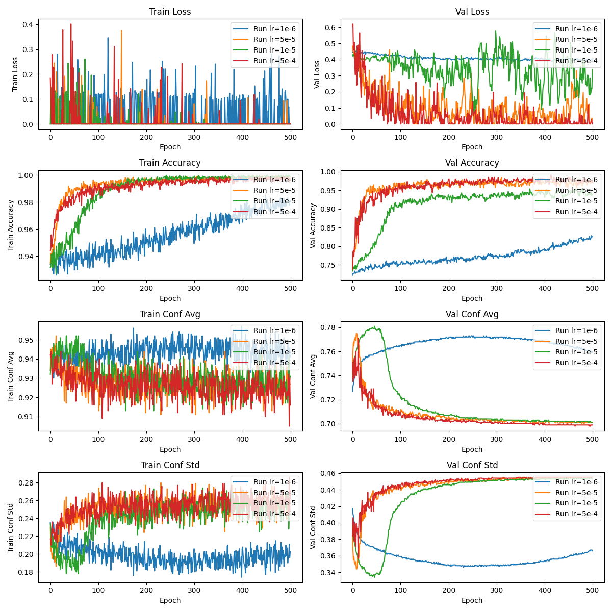

# Open Speaker

Open-set speaker verification using ResNet and triplet loss.

The training dataset consists of 300 speakers, each with 10 spoken word clips

Designed and implemented for my deep learning final project.

Inspired by these papers:

@ARTICLE{8721628,
  author={An, Nguyen Nang and Thanh, Nguyen Quang and Liu, Yanbing},
  journal={IEEE Access}, 
  title={Deep CNNs With Self-Attention for Speaker Identification}, 
  year={2019},
  volume={7},
  number={},
  pages={85327-85337},
  doi={10.1109/ACCESS.2019.2917470}}

@ARTICLE{10502125,
  author={Li, Jianchen and Han, Jiqing and Qian, Fan and Zheng, Tieran and He, Yongjun and Zheng, Guibin},
  journal={IEEE/ACM Transactions on Audio, Speech, and Language Processing}, 
  title={Distance Metric-Based Open-Set Domain Adaptation for Speaker Verification},
  year={2024},
  volume={32},
  number={},
  pages={2378-2390},
  doi={10.1109/TASLP.2024.3389646}}
